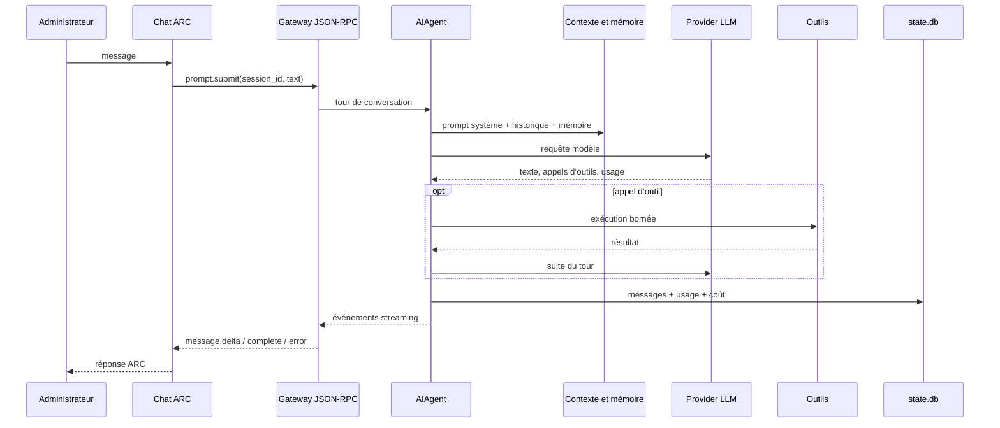

# Flux IA actuel

## Message envoyé depuis le Chat ARC

## Points de construction

1. Le Chat crée ou reprend une session au moyen du SDK de passerelle.
2. `gateway` hydrate l’agent correspondant à la session et transmet le prompt.
3. `agent/conversation_loop.py` restaure ou construit le prompt système.
4. `agent/prompt_builder.py` assemble identité, contexte hôte, directives,
   compétences et catalogue d’outils. Le prompt est conservé pour préserver le
   cache provider lorsqu’il reste compatible avec le runtime.
5. `agent/context_engine.py` et le gestionnaire de mémoire ajoutent le contexte
   récupéré. Les fichiers projet et les mémoires ne sont pas tous injectés de
   manière identique : certains sont dans le prompt, d’autres sont accessibles
   par outils ou par recherche.
6. Le client du provider actif reçoit les messages et schémas d’outils.
7. La boucle exécute les outils autorisés, ajoute leurs résultats puis rappelle
   le provider si nécessaire.
8. Les messages et les compteurs sont persistés dans SQLite. Le Chat reçoit les
   événements de progression et resynchronise les sessions longues.

## Mémoire et documents

- `MEMORY.md` et les providers mémoire alimentent la mémoire durable de l’agent.
- L’historique de conversation réside dans `state.db` et son index FTS5.
- Le coffre ARC `$HERMES_HOME/knowledge` n’est pas injecté en masse. Dans le
  flux applicatif ARC Core, le Context Builder construit un plan, applique les
  ACL, récupère des chunks bornés et transmet leurs `source_id` à Hermes.
- La recherche reste lexicale et déterministe dans ce lot ; son index dérivé
  prépare une extension sémantique sans imposer d’embedding.

## Providers et mesure

Le point canonique de mesure est dans `agent/conversation_loop.py`, après la
réponse provider. `normalize_usage` harmonise les formats OpenAI, Anthropic et
Responses. Le code mesure : modèle, provider, tokens, cache, raisonnement,
durée, nombre d’appels et coût estimé. `queue_token_counts` persiste les deltas
dans `state.db` sans bloquer la boucle.

Les logs d’appel contiennent les métriques techniques mais pas le prompt ou la
conversation intégrale. Les secrets restent hors des journaux.

## Point d’insertion futur de l’orchestrateur

Le futur orchestrateur doit intervenir entre l’identité/session validée par la
passerelle et la création de l’agent. Il sélectionnera un profil spécialisé,
une politique de modèle, des collections RAG et des outils autorisés, sans
court-circuiter la boucle, la comptabilité, les approbations ni l’audit actuels.

## Flux applicatif introduit au lot 01

La route interne versionnée authentifie l'application, conserve séparément
l'utilisateur éventuel, résout ARC ou ATS dans l'Agent Manager, construit un
contexte effectif, récupère les connaissances autorisées et appelle `_run_agent`
derrière `HermesAgentEngine`. La boucle provider et l'instrumentation
historiques restent ainsi les seules implémentations de l'inférence et de la
mesure.
