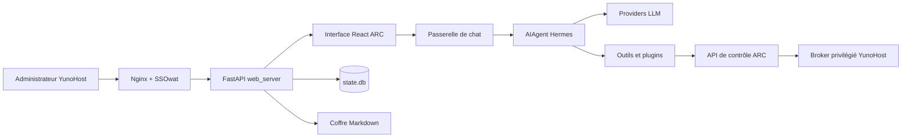

# Architecture actuelle d’ARCenal Agent

État observé sur la branche `arcenal`, version Python `0.21.0+arcenal.6`.
Ce document décrit le dépôt applicatif. Le paquet natif YunoHost est maintenu
séparément dans `arcenal-coder/arcenal_ynh` ; ses scripts ne sont donc pas
auditables depuis ce dépôt.

## Vue d’ensemble

## Application

| Élément | Réalisation actuelle | Emplacement principal |
|---|---|---|
| Backend web | Python 3.11–3.13, FastAPI/Uvicorn | `hermes_cli/web_server.py` |
| API de contrôle | FastAPI séparée, sans documentation publique | `plugins/arcenal-supervisor/control_api.py` |
| Frontend | React 19, TypeScript strict, Vite, CSS variables | `web/src`, `plugins/arcenal-supervisor/dashboard` |
| Base principale | SQLite, WAL configurable, FTS5 | `hermes_state.py`, `$HERMES_HOME/state.db` |
| Données documentaires | Markdown canonique, pièces jointes et index dérivé | `$HERMES_HOME/knowledge`, `$HERMES_HOME/arcenal/knowledge-index.json` |
| Configuration | YAML et secrets d’environnement séparés | `$HERMES_HOME/config.yaml`, `$HERMES_HOME/.env` |
| Tâches | Cron interne, tâches asynchrones de passerelle et sous-agents | `cron`, `gateway`, `run_agent.py` |
| Cache | caches de médias, modèle, outils et prompt sous `HERMES_HOME` | `hermes_constants.py`, `gateway`, `agent` |
| Logs | journal Python, audit ARC chaîné, métriques agrégées | `hermes_logging.py`, `plugins/arcenal-supervisor/security/audit.py` |

La façade métier expose trois volets : ARC, Agents, RAG & LDA. Les routes
techniques Hermes restent dans le socle mais ne constituent pas la navigation
principale ARC.

## IA

- `run_agent.py` construit l’instance `AIAgent` et sélectionne provider, modèle,
  outils, mémoire et stratégie de contexte.
- `agent/conversation_loop.py` exécute la boucle modèle → outils → modèle.
- `agent/prompt_builder.py` et `agent/system_prompt.py` assemblent le prompt.
- `agent/context_engine.py`, `agent/context_compressor.py` et les providers de
  mémoire gèrent la pression de contexte et la récupération.
- Les providers natifs et compatibles couvrent notamment OpenRouter, OpenAI,
  Anthropic, Gemini, Mistral, Ollama et les endpoints OpenAI compatibles.
- Les appels exposent déjà provider, modèle, tokens d’entrée/sortie/cache,
  durée et estimation de coût. Les agrégats sont persistés dans `state.db`.
- Le catalogue d’outils Hermes est étendu par le plugin
  `arcenal-supervisor`, qui apporte les outils système, connaissance, mémoire,
  accès et réparation contrôlée.

## Administration et sécurité

- En production YunoHost, Nginx/SSOwat est l’autorité d’accès attendue et le
  groupe `admins` limite l’interface d’administration.
- L’identité de l’administrateur arrive dans `Remote-User` ou
  `X-Remote-User`. Une identité absente ou invalide est refusée par l’API de
  contrôle et par les transitions documentaires sensibles.
- La politique ARC applique quatre niveaux d’autorisation, un catalogue fermé,
  des cibles validées et un refus par défaut.
- Une action sensible suit préparation, présentation des conséquences,
  confirmation humaine, jeton à usage unique, exécution par le broker et audit.
- Le modèle n’accède pas directement à un shell root. Le broker privilégié est
  un composant du paquet YunoHost séparé ; le dépôt applicatif contient son
  client et ses contrats mais pas la recette d’installation complète.
- Le journal d’audit JSONL expurge les clés sensibles et chaîne chaque entrée
  par SHA-256.

## Interfaces et API

| Surface | État |
|---|---|
| Chat ARC | Plugin React natif, sessions, streaming, approbations, maintenance et archivage |
| Agents | Profils spécialisés et mémoire `MEMORY.md` isolée |
| RAG & LDA | Index reconstructible, chunks, ACL, recherche lexicale, workflow, LDA, wiki et citations |
| Paramètres | Général, apparence, providers, accès, autonomie, contexte, mémoire, directives, capacités |
| Système | Inventaire lu via le broker local YunoHost |
| API plugin | Routeurs montés sous `/api/plugins/arcenal-supervisor` |
| API agents | Route versionnée `/api/v1/agents/{agent_id}/query` vers ARC Core |
| API contrôle | Routes séparées sous `/api/arcenal-control` dans le déploiement |
| Passerelle chat | JSON-RPC interne : sessions, prompt, événements et approbations |

## Thème

`web/src/arcenal-theme.css` est la source de vérité des jetons sémantiques ARC.
`useArcColorMode` applique le mode clair, sombre ou système à la racine. Les
réglages persistés appliquent la couleur dominante et sa couleur de contraste
au conteneur `.arcenal-shell`. Le Chat consomme le même contrat depuis
`plugins/arcenal-supervisor/dashboard/src/style.css`.

## ARC Core et agents spécialisés

Le plugin fournit désormais un ARC Core léger, un Agent Manager et un registre
persistant. ARC et Agent ATS utilisent le même Context Builder, le même moteur
Hermes, les mêmes contrôles et le même audit. Le client ne choisit jamais ses
permissions ou son prompt système. La page Agents expose le registre et une
fiche persistante limitée aux réglages sûrs.

Le Context Builder produit maintenant un `ContextPlan` serveur. Le RAG filtre
statut, version, source, scope, application, agent, utilisateur, permissions et
confidentialité avant le score. L'API agent renvoie les citations issues de ce
filtrage et le volet RAG affiche l'état de l'index et sa reconstruction contrôlée.

## Limites de cette cartographie

- Les scripts Nginx, SSOwat, systemd, sauvegarde et broker du paquet YunoHost
  doivent être audités dans `arcenal_ynh` avant une promotion en production.
- Le dépôt conserve un vaste socle Hermes ; les points ARC doivent continuer à
  rester dans des plugins ou adaptateurs pour faciliter les mises à jour amont.
