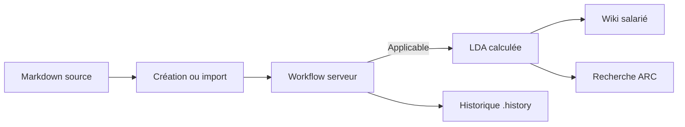

# État actuel de la LDA et du wiki

## Modèle actuel

La LDA n’est pas une table indépendante. Elle est calculée à partir des fichiers
Markdown dont le frontmatter porte `statut: Applicable`. Le wiki présente la
même population en lecture.

## Fonctions présentes

- création et édition Markdown ;
- dépôt d’une pièce jointe PDF, DOCX, ODT, Markdown ou texte avec contrôles de
  taille et signature minimale ;
- frontmatter et liens `[[Wiki]]` ;
- liens entrants calculés ;
- statuts `Brouillon`, `En révision`, `À approuver`, `Applicable`, `Archivé` ;
- transitions autorisées côté serveur ;
- approbateur issu de l’identité YunoHost ;
- archivage de l’ancienne version applicable portant la même référence ;
- historique horodaté et restauration avec confirmation ;
- registre LDA, statistiques, filtres et vue wiki ;
- recherche lexicale par référence, titre et contenu.

## Stockage et droits

- Documents : `$HERMES_HOME/knowledge/**/*.md`, mode privé au service.
- Pièces jointes : `knowledge/.attachments`.
- Versions : `knowledge/.history`.
- Les chemins sont résolus sous la racine et les échappements sont refusés.
- Les écritures sont atomiques.
- Une transition exige une identité administrateur valide.
- Le wiki retourne uniquement les versions `Applicable`. La permission exacte
  d’accès au wiki est finalisée par SSOwat dans le paquet YunoHost séparé.

## Comparaison avec le cycle cible

| Étape cible | Couverture actuelle | Écart |
|---|---|---|
| Document source | oui | extraction du contenu des pièces jointes absente |
| Import / création | oui | import en masse et traitements asynchrones absents |
| Page Wiki | oui | retour salarié et proposition d’amélioration incomplets |
| Validation | oui | signature avancée et délégation métier à préciser |
| Version applicable | oui | modèle de version encore porté par frontmatter |
| LDA | oui, vue calculée | requêtes et exports avancés à consolider |
| Indexation RAG | index lexical central et reconstructible | embeddings différés |
| Agents autorisés | ContextPlan et ACL avant recherche | délégation documentaire avancée différée |

## Données à préserver

Les Markdown, pièces jointes et historiques sont les sources canoniques. Une
future base de métadonnées ou un index vectoriel doit être une projection
reconstruisible. Aucune migration ne doit supprimer ou réécrire les documents
sans archive, validation de schéma et sauvegarde YunoHost vérifiée.
