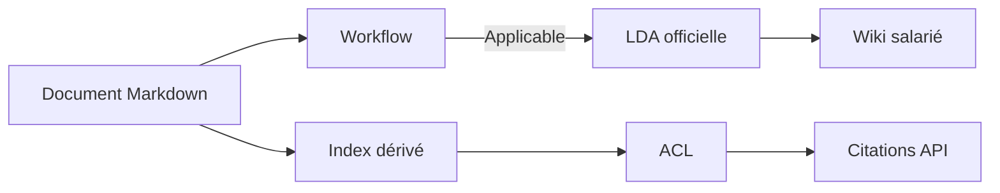

# Intégration LDA, wiki et RAG

## Source commune

La LDA et le wiki ne dupliquent pas les documents. Ils sélectionnent la même
population de Markdown au statut `Applicable`. Le RAG normalise cette source et
conserve également les autres statuts dans son index dérivé, sans les utiliser
par défaut.

## Versions

Une nouvelle version applicable archive toute version applicable portant la
même référence. Le plan courant ne sélectionne que `Applicable`. Une version
`Archivé` n’est accessible que si la requête demande l’historique et que
l’agent possède `lda.history`.

## Citation officielle

Une source expose identifiant, document, titre, référence, version, section,
chemin et statut. L’API peut donc afficher « PR-RH-004 V2, Validation » sans
demander au modèle d’inventer cette référence. Le wiki salarié continue de ne
servir que les documents applicables.
