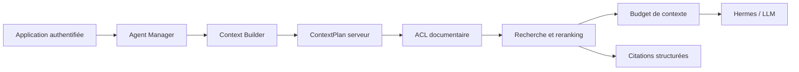

# RAG central ARCenal

## Architecture

Le RAG central est une extension d’ARC Core. Il intervient après la résolution
de l’agent et avant l’appel au moteur Hermes.

Les Markdown sous `$HERMES_HOME/knowledge` restent la source de vérité. Le
fichier `$HERMES_HOME/arcenal/knowledge-index.json` est une projection dérivée,
atomique et supprimable. Sa reconstruction ne modifie jamais les originaux.

## Sources et normalisation

Le lot 02 indexe la source réellement présente : le coffre Markdown, dont la
LDA et le wiki sont deux vues des versions `Applicable`. Chaque document est
normalisé avec son identifiant, titre, référence, version, statut, propriétaire,
domaine, scopes, confidentialité, dates et chemin canonique.

Les métadonnées ACL facultatives sont `applications`, `agents`, `utilisateurs`
et `permissions`. Sans scope explicite, un document reçoit le scope prudent
`company`. Sans confidentialité explicite, il est `internal`.

## Chunking et recherche

Le découpage suit les titres Markdown puis regroupe les paragraphes, listes et
tableaux sans dépasser 1 800 caractères par fragment. L’identifiant d’un chunk
est déterministe pour une version et un contenu donnés.

La recherche est lexicale, filtrée par métadonnées avant calcul du score, puis
rerankée de façon déterministe. Le contrat permet d’ajouter ultérieurement un
score sémantique sans modifier ARC Core. Aucun appel LLM n’est utilisé pour le
reranking.

## Citations et absence de résultat

Chaque fragment sélectionné produit une `SourceCitation` structurée. L’API
agent renvoie ces sources indépendamment du texte généré. Le modèle reçoit
uniquement des `source_id` calculés par le serveur et l’instruction de ne
citer aucun autre identifiant. Sans résultat, le contexte indique explicitement
qu’aucune source applicable n’a été trouvée.

## Persistance et métriques

Les métriques agrégées résident dans
`$HERMES_HOME/arcenal/knowledge-metrics.json`. Elles ne contiennent aucun
fragment documentaire. Elles suivent les recherches, résultats vides, durée,
documents et chunks sélectionnés, taille du contexte et sources par agent.

## Administration

`GET /api/plugins/arcenal-supervisor/knowledge/index/status` expose l’état de
l’index. `POST /api/plugins/arcenal-supervisor/knowledge/index/rebuild?confirmed=true`
exige une identité administrateur YunoHost et reconstruit l’index. Le volet
RAG & LDA présente les compteurs, la date, les erreurs et ce bouton contrôlé.

## YunoHost Deployment Requirements

- persister `$HERMES_HOME/knowledge` et `$HERMES_HOME/arcenal` ;
- conserver le propriétaire du service ARC et des modes privés sur les JSON ;
- inclure ces deux répertoires dans la sauvegarde de données applicatives ;
- protéger l’administration et la reconstruction par SSOwat, groupe `admins` ;
- ne pas ajouter de variable d’environnement ni de service externe ;
- laisser `/wiki` et ses seules versions `Applicable` sous la permission wiki
  déjà définie par le paquet séparé.

Le packaging YunoHost n’est pas modifié dans ce lot.
