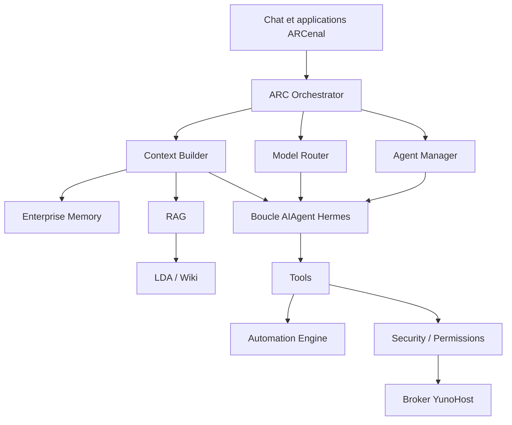

# Architecture cible ARC Core

## Principe de migration

La cible doit rester une couche ARC périphérique au moteur Hermes. Le cœur
amont conserve providers, sessions, boucle agentique, outils, mémoire et
passerelle. ARC Core apporte les décisions métier, l’isolation et la sécurité.

## Briques existantes à réutiliser

| Cible | Existant réutilisable |
|---|---|
| Orchestrator | gateway, sessions, plugin hooks, `run_conversation` |
| Agent Manager | profils Hermes, API Agents, mémoire isolée |
| Model Router | registre providers, fallback, coût et métriques |
| Context Builder | prompt builder, context engine, memory manager |
| Enterprise Memory | fichiers gérés et providers mémoire |
| RAG | coffre Markdown et outils de recherche/lecture |
| LDA / Wiki | workflow documentaire et vue `Applicable` |
| Tools | toolsets Hermes et catalogue ARC |
| Automation | cron, hooks et tâches de gateway |
| Security | identité YunoHost, policy, approvals, audit, broker |

## Évolution la moins disruptive

1. Étendre le service ARC Core versionné désormais présent dans le plugin sans
   exposer de nouvelle route hors de son contrat d'authentification.
2. Faire évoluer le registre d'agents existant par migration, sans copier les
   providers, la sécurité ou le moteur.
3. Placer le choix modèle/provider derrière une politique mesurable utilisant
   les compteurs existants.
4. Ajouter un `ContextPlan` immuable décrivant les collections, droits, budget
   et citations avant d’étendre le RAG.
5. Faire du coffre actuel la collection documentaire initiale ; ajouter un
   index sémantique reconstruisible, jamais propriétaire des originaux.
6. Conserver toute mutation YunoHost derrière la chaîne d’approbation existante.

## Contrats à stabiliser avant extraction

- identité de requête et corrélation ;
- référence stable d’un agent/profil ;
- politique de permissions et d’autonomie ;
- sélection de collections de connaissance ;
- enveloppe de réponse avec citations, usage et audit ;
- erreurs métier versionnées et sans détail sensible.

ARC Core ne doit pas connaître les secrets bruts des providers ni permettre
une commande root libre. Ces responsabilités restent dans les composants
spécialisés actuels.

Le lot 01 matérialise déjà `Application -> Agent Manager -> Context Builder ->
ARC Core -> Hermes`. Le lot 02 doit insérer le contrôle ACL du RAG entre le
Context Builder et le coffre, en utilisant `knowledge_scopes` comme entrée.
